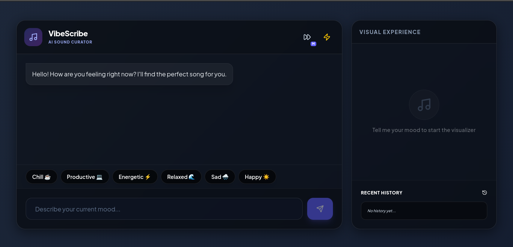
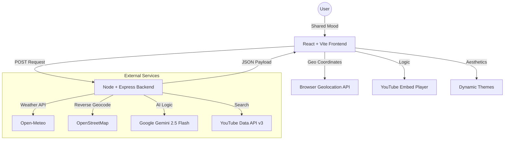

# VibeScribe: AI-Powered Sound Curator 🎵

VibeScribe is a premium, AI-driven music curation platform that translates your current mood and environment into the perfect auditory experience. By blending real-time sentiment analysis, local weather data, and Google's Gemini AI, VibeScribe delivers a personalized soundscape that matches your exact vibe.

---

## 📸 Visual Walkthrough

### 1. Initial State: Discover Your Vibe
*Enter your mood to begin the AI journey. The dynamic glassmorphic interface awaits your input.*


### 2. Result State: Immersive Experience
*After analyzing your mood and local weather, the AI recommends a song, updates the color palette, and loads the official video player.*

<!-- SCREENSHOT_AFTER_VIDEO -->

<!-- Leave space for: Screenshot of the application after a song is recommended and the video player is active -->

---

## ✨ Core Features

- **🧠 AI Mood Interpretation**: Deep sentiment analysis of user input to find the "soul" of the recommendation.
- **🌍 Environmental Integration**: Fetches real-time weather (temp & condition) via Open-Meteo to contextualize recommendations.
- **🎨 Dynamic Color Theory**: The application's color palette (background & panels) shifts dynamically to match the AI-suggested aesthetic for each song.
- **📹 Integrated YouTube Visuals**: Seamless embedding of official audio/video for the recommended tracks.
- **🚀 Ultra-Responsive UI**: Built with React and Framer Motion for premium, fluid animations.

---

## 🏗️ System Architecture



---

## 🛠️ Tech Stack

### Frontend
- **React 18** (Vite)
- **Tailwind CSS** (Styling)
- **Framer Motion** (Animation)
- **Lucide React** (Icons)

### Backend
- **Node.js + Express**
- **Axios** (API Management)
- **Dotenv** (Security)

### AI & APIs
- **Google Gemini AI**: The brains behind song selection and color theory.
- **YouTube Data API v3**: Fetches relevant video content.
- **Open-Meteo**: Provides real-time weather analytics.
- **Nominatim**: Converts coordinates to human-readable locations.

---

## 🚀 Getting Started

### 1. Prerequisites
- Node.js (v18+)
- NPM or Yarn
- API Keys: [Google AI Studio (Gemini)](https://aistudio.google.com/) and [Google Cloud Console (YouTube)](https://console.cloud.google.com/).

### 2. Environment Setup
Create a `.env` file in the `/backend` directory:
```env
GEMINI_API_KEY=your_gemini_key_here
YOUTUBE_API_KEY=your_youtube_key_here
```

### 3. Installation & Launch

**Run Backend:**
```bash
cd backend
npm install
npm start
```

**Run Frontend:**
```bash
cd frontend
npm install
npm run dev
```

---

## 📁 Project Structure

```text
.
├── backend/            # Express.js Server
│   ├── scripts/        # Utility/Debug scripts (list models, test Gemini)
│   ├── server.js       # Main entry point & API Logic
│   └── package.json
├── frontend/           # React + Vite Application
│   ├── src/            # Components, Hooks, & Styling
│   ├── public/         # Static assets
│   └── package.json
├── .gitignore          # Root-level git configuration
├── README.md           # Master Documentation
└── LICENSE             # MIT License
```

---

## 📄 License

This project is licensed under the MIT License - see the [LICENSE](LICENSE) file for details.
