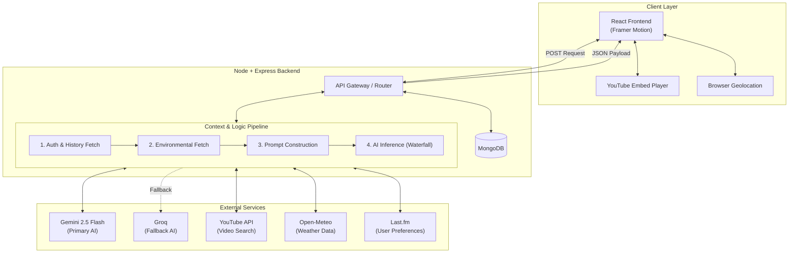

# AuraBeat 🎵
### Context-Aware Music Recommendation & Intelligent Audio Curation

<p align="center">
  
  
  
  
  
  
</p>

---

AuraBeat is a premium, AI-driven music curation platform that translates your current mood, music preferences, and environment into the perfect auditory experience. By blending real-time sentiment analysis, local weather data, Last.fm listening history, and a resilient LLM Waterfall system (Google Gemini + Groq), AuraBeat delivers a highly personalized soundscape, complete with dynamic aesthetic UI adaptations.

---

## 📸 Visual Walkthrough

### 1. Initial State: Discover Your Vibe
*Enter your mood to begin the AI journey. The dynamic glassmorphic interface awaits your input.*

<!-- SCREENSHOT_BEFORE_VIDEO -->

<!-- Leave space for: Screenshot of the application before any mood is entered -->

### 2. Result State: Immersive Experience
*After analyzing your mood and local weather, the AI recommends a song, updates the color palette, and loads the official video player.*

<!-- SCREENSHOT_AFTER_VIDEO -->

<!-- Leave space for: Screenshot of the application after a song is recommended and the video player is active -->

---

## 💻 Tech Stack

**Frontend (React & Vite)**
* **Framework:** React 18
* **Styling:** Tailwind CSS, Framer Motion (for dynamic UI components like `WaveformVisualizer` and `AuthModal`)
* **Build Tool:** Vite
* **Icons:** Lucide React

**Backend (Node.js API)**
* **Framework:** Express.js
* **Database:** MongoDB (Mongoose ODM)
* **Authentication:** JWT (JSON Web Tokens) & bcryptjs
* **Security:** Helmet, express-rate-limit, express-mongo-sanitize, hpp

**AI & Cloud Services**
* **Primary AI Engine:** Google Gemini 2.5 Flash
* **Fallback AI Engine:** Groq (Llama-3.3-70b-versatile)
* **Video Content:** YouTube Data API v3
* **Music Preferences:** Last.fm API
* **Environmental Data:** Open-Meteo API & Nominatim (OpenStreetMap)

---

## 🌐 System Architecture & Orchestration

AuraBeat utilizes a distinct separation between client-side responsiveness and server-side AI processing to ensure smooth UI animations alongside complex LLM analysis.

### System Diagram


```mermaid
graph TD
    %% Client Layer
    subgraph Client [Client Layer]
        A["React Frontend \n (Framer Motion)"]
        M["YouTube Embed Player"]
        Geo["Browser Geolocation"]
        A <--> M
        A <--> Geo
    end

    %% Cloud/API Layer
    subgraph Backend [Node + Express Backend]
        B["API Gateway / Router"]
        DB[(MongoDB)]
        
        subgraph Pipeline [Context & Logic Pipeline]
            C1["1. Auth & History Fetch"]
            C2["2. Environmental Fetch"]
            C3["3. Prompt Construction"]
            C4["4. AI Inference (Waterfall)"]
            C1 --> C2 --> C3 --> C4
        end
        
        B <--> Pipeline
        B <--> DB
    end

    %% Inference Layer
    subgraph Inference [External Services]
        D["Gemini 2.5 Flash \n (Primary AI)"]
        D2["Groq \n (Fallback AI)"]
        E["YouTube API \n (Video Search)"]
        F["Open-Meteo \n (Weather Data)"]
        G["Last.fm \n (User Preferences)"]
    end

    %% Connections
    A <-->|POST Request| B
    
    Pipeline <--> D
    Pipeline -.->|Fallback| D2
    Pipeline <--> E
    Pipeline <--> F
    Pipeline <--> G
    
    B -->|JSON Payload| A
```

### Why the Ecosystem Modules Exist Separately

**`frontend/` — React SPA Canvas**
Built as a highly responsive single-page application utilizing Framer Motion. This ensures that the dynamic color palette shifts and complex visual feedback happen instantly without page reloads, providing a premium, native-feeling user experience.

**`backend/` — Node.js AI Engine**
Acts as the central orchestrator. It securely manages authentication, database interactions, and API keys. Crucially, it houses the **LLM Waterfall logic**, ensuring that if the primary Gemini AI fails, the request gracefully falls back to Groq without interrupting the user experience.

---

## 🤖 Context-Aware AI Pipeline

The application utilizes a multi-stage approach to refine raw user emotion into a tangible multimedia response.

| Stage | Responsibility |
|-------|----------------|
| 1. **Auth & Preferences** | Authenticates the user via JWT, retrieving their past mood history and fetching their favorite artists via Last.fm API. |
| 2. **Environmental Ingestion** | Resolves raw GPS coordinates into human-readable locations and fetches current weather state constraints. |
| 3. **Sentiment Translation** | The LLM processes the user's prompt string to infer mood, tempo desires, and lyrical needs. |
| 4. **Curation Engine** | Cross-references the sentiment against the environmental baseline and user history to suggest an optimal track and matching color hex schema. |
| 5. **Execution & Retrieval** | Interrogates the YouTube Data API to find the exact official video for the curated track. |

---

## 📁 Project Directory Map

```text
aurabeat-root/
├── backend/                      # Production API Environment
│   ├── scripts/                  # Utility & Debug routines
│   ├── server.js                 # API Core, Auth, & Gateway routing
│   └── package.json
├── frontend/                     # Client Canvas Application
│   ├── src/
│   │   ├── components/           # UI (AuthModal, SettingsPanel, WaveformVisualizer, etc.)
│   │   ├── hooks/                # Custom React Hooks (useColorTransition, useMoodHistory)
│   │   └── App.jsx               # Main Application State
│   ├── public/                   # Static binary assets
│   └── package.json
├── README.md                     # Master Documentation
└── LICENSE                       # MIT License
```

---

## 🚀 Getting Started

### 1. Prerequisites
* Node.js (v18+)
* MongoDB (Local instance or Atlas URI)
* API Keys for: 
  - [Google AI Studio (Gemini)](https://aistudio.google.com/)
  - [Groq Cloud (Fallback AI)](https://console.groq.com/)
  - [Google Cloud Console (YouTube)](https://console.cloud.google.com/)
  - [Last.fm API](https://www.last.fm/api)

### 2. Environment Setup
Create a `.env` file in the `/backend` directory:
```env
YOUTUBE_API_KEY=your_youtube_key_here
GEMINI_API_KEY=your_gemini_key_here
GROQ_API_KEY=your_groq_key_here
LASTFM_API_KEY=your_lastfm_key_here
MONGODB_URI=mongodb://localhost:27017/aurabeat
JWT_SECRET=your_long_secure_random_string
```

### 3. Installation & Launch

**Run Backend:**
```bash
cd backend
npm install
npm start
```

**Run Frontend:**
```bash
cd frontend
npm install
npm run dev
```

---

<p align="center">Made with ❤️ for <strong>Music Lovers Everywhere</strong></p>

---

## 📄 License

<details>
<summary>MIT License — click to expand</summary>

```
MIT License

Copyright (c) 2026 AuraBeat

Permission is hereby granted, free of charge, to any person obtaining a copy
of this software and associated documentation files (the "Software"), to deal
in the Software without restriction, including without limitation the rights
to use, copy, modify, merge, publish, distribute, sublicense, and/or sell
copies of the Software, and to permit persons to whom the Software is
furnished to do so, subject to the following conditions:

The above copyright notice and this permission notice shall be included in all
copies or substantial portions of the Software.

THE SOFTWARE IS PROVIDED "AS IS", WITHOUT WARRANTY OF ANY KIND, EXPRESS OR
IMPLIED, INCLUDING BUT NOT LIMITED TO THE WARRANTIES OF MERCHANTABILITY,
FITNESS FOR A PARTICULAR PURPOSE AND NONINFRINGEMENT. IN NO EVENT SHALL THE
AUTHORS OR COPYRIGHT HOLDERS BE LIABLE FOR ANY CLAIM, DAMAGES OR OTHER
LIABILITY, WHETHER IN AN ACTION OF CONTRACT, TORT OR OTHERWISE, ARISING FROM,
OUT OF OR IN CONNECTION WITH THE SOFTWARE OR THE USE OR OTHER DEALINGS IN THE
SOFTWARE.
```

</details>
